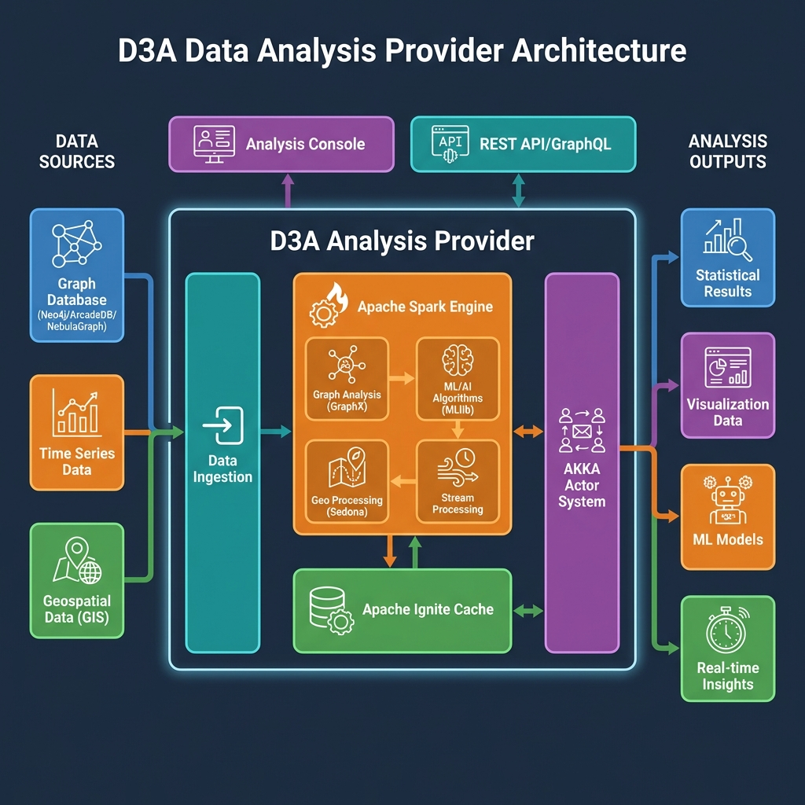

# D3A - Data Analysis & AI Algorithm Platform

***

#  Data Analysis Provider  Usage Guide

## Overview

The D3A Data Analysis Provider is a powerful distributed analysis engine that processes graph data, time series data, and geospatial information using Apache Spark, Apache Ignite, and AKKA Actor System.

## Key Features

- **Graph Analysis**: Process complex relationship networks using GraphX
- **Machine Learning**: Apply ML/AI algorithms using Spark MLlib
- **Geospatial Processing**: Analyze spatial data with Apache Sedona (GeoSpark)
- **Stream Processing**: Real-time data analysis capabilities
- **Distributed Cache**: High-performance caching with Apache Ignite
- **Actor-based Concurrency**: Scalable processing using AKKA

## Data Sources

The Analysis Provider can ingest data from:
- Graph databases (Neo4j, ArcadeDB, NebulaGraph)
- Time series databases
- Geospatial data sources (GIS formats)

## Analysis Outputs

Results can be delivered as:
- Statistical analysis results
- Visualization-ready data
- Trained ML models
- Real-time streaming insights

## API Access

Access the Analysis Provider through:
- **REST API**: Standard HTTP endpoints
- **GraphQL**: Flexible query interface
- **Analysis Console**: Interactive web interface